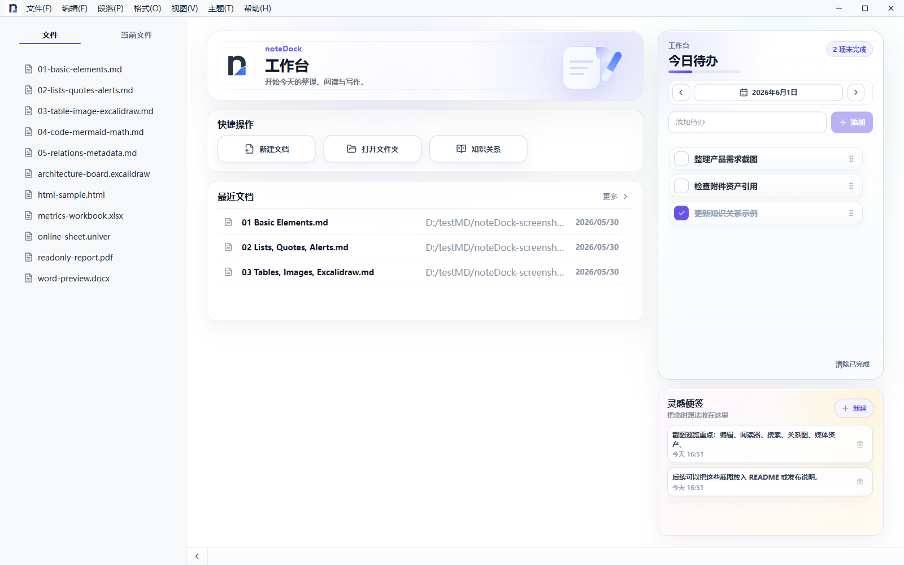
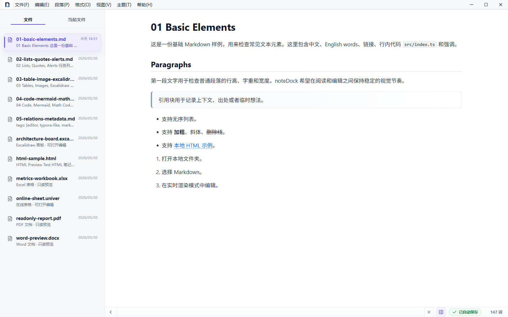
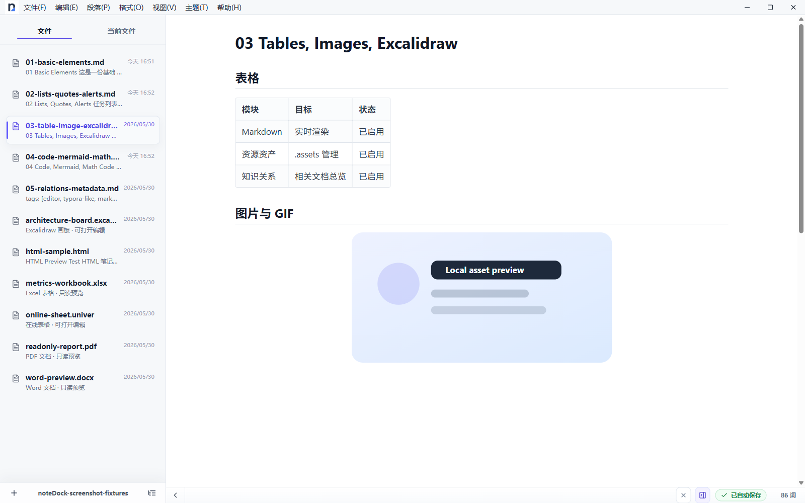
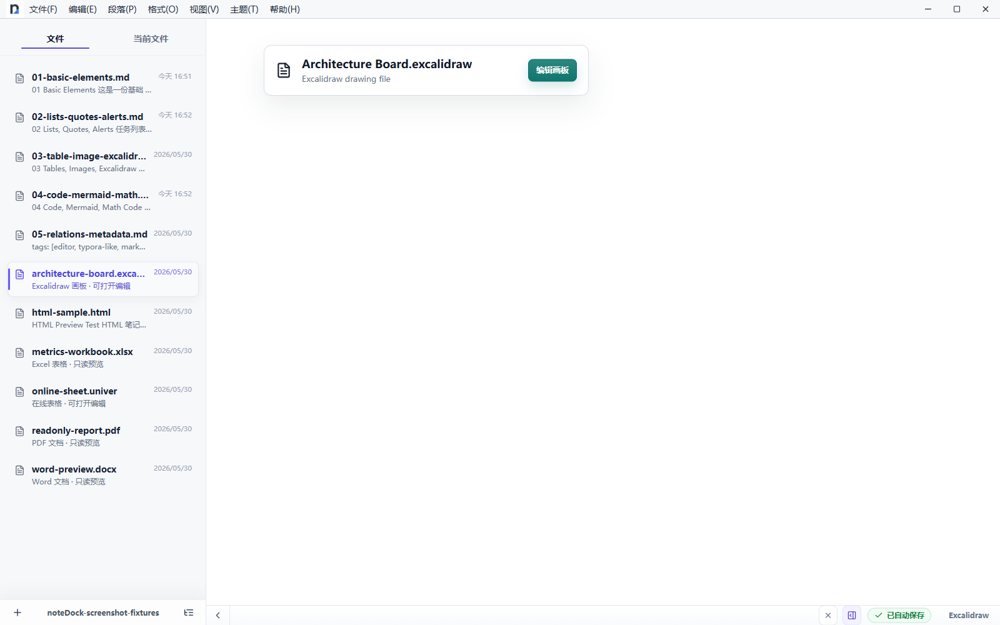
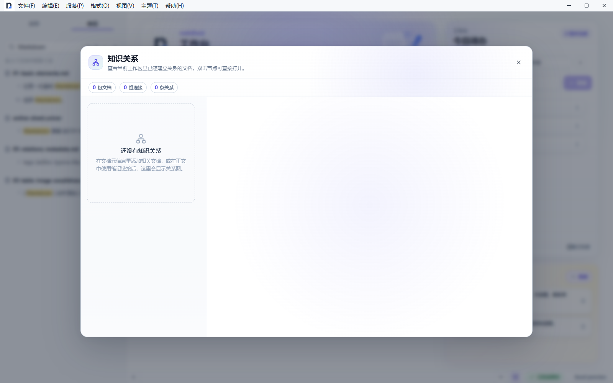

# noteDock

> 本地优先、安静好用的 Markdown 笔记与阅读空间。

noteDock 是一款桌面 Markdown 应用。它把接近 Typora 的沉浸式写作体验、工作区文件管理、日记、附件和常用文档阅读整合在同一个本地工作区中，让笔记和资源可以一起保存、迁移与备份。

当前版本：`v1.0.5`

## 界面一览

### 工作台

快速新建文档、打开工作区，并查看最近笔记、日记与今天的待办。



### Markdown 写作

所见即所得编辑、源码与预览模式，支持表格、任务列表、数学公式、Mermaid 和常用 Markdown 语法。



### 图片与媒体

拖入或粘贴图片、视频和 GIF，资源会保存在当前文档所在工作区，方便随笔记一起备份；图片支持对齐、适配和拖动调整宽度。



### 图形与文档

内嵌 Excalidraw 图形、知识关系，并支持 PDF、Word、Excel、HTML 与表格文档阅读。





## 功能

- 本地工作区、文件树与文档详情列表
- Markdown 沉浸式编辑与实时预览
- 图片、视频等附件随工作区保存，支持在文件夹中显示
- 日记树、日历与时间线视图，以及模板、心情和标签
- 待办与灵感便签
- Excalidraw、React Flow、思维导图与 Univer 表格
- PDF、Word、Excel、HTML 等文档预览
- 文档历史、最近文档与可选云同步

## 运行

```bash
npm install
npm run dev
```

`npm run dev` 会先检查 Electron 运行环境，再启动桌面应用。

本地同步服务与桌面应用一键启动：

```bash
# macOS
npm run dev:local:mac

# Windows
npm run dev:local
```

macOS 也可以分别启动同步服务或桌面应用：

```bash
npm run dev:local:mac:server
npm run dev:local:mac:app
npm run dev:local:mac:app:debug
```

`dev:local:mac:app:debug` 会打开开发者工具，并使用临时用户数据目录，适合排查本地缓存和启动问题。

启动同步服务后，在应用的“设置 > 同步”中填入脚本输出的本地地址、用户名和密码即可连接。

## 构建

```bash
npm run build
npm run dist:mac
npm run dist:win
```

构建后的应用可以通过下面的命令预览：

```bash
npm run preview
```

## 项目结构

```text
src/
  main/       Electron 主进程
  preload/    桥接桌面能力的 preload 脚本
  renderer/   React 渲染进程
```

项目使用 electron-vite、React 与 Radix UI 构建。
